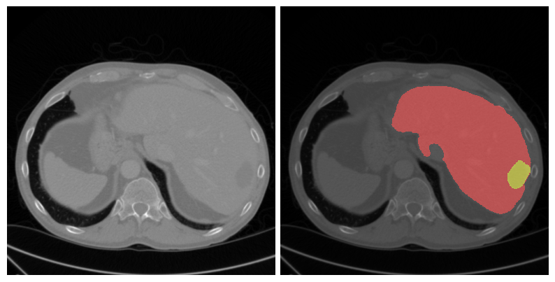

# Attention Residual UNet for Liver and Hepatic Vessel Segmentation

This repository contains the code used for liver and hepatic vessel segmentation from CT images, developed as part of a research paper on segmentation models using Attention Residual UNet. The project leverages the Medical Decathlon dataset and focuses on accurately segmenting the liver and hepatic vessels from CT scans.


### Folder structure

```bash
.                                                                                       
├── data                      <- Data dirs should NOT be checked into git
│   └── raw                   <- The final dataset for model        
├── docs                      <- Documentation for project 
├── .gitignore                <- Ignore files that should not be commited 
├── main.py                   <- This file will be called when running a slurm job.
├── models                    <- Trained models, model predictions or model summaries.
├── notebooks                 <- Jupyter notebooks. 
├── README.md                 <- README file for this git repo.
├── requirements.txt          <- Pip modules to be installed. See "pip install -r".
├── RUN_FIRST.sh              <- RUN THIS FIRST! uncaches data dirs.
├── setup.sh                  <- This file will be called before *main.py* when running a slurm job.
└── src                       <- Source code for this project.
    ├── __init__.py           <- Makes src a python module.
    ├── data                  <- Scripts to download and process data.
    ├── models                <- Scripts to train models and make predictions.
    └── visualisation         <- scripts to create visualisations
```

### RUN_FIRST.sh

Please run the following command before making any changes to the directory:

```bash
bash RUN_FIRST.sh
```

This script will untrack the data and output directories, so they don't get checked into the remote repository, and then delete itself.

### Data storage

As git should not be used to store large amounts of unchanging data, please do not check image files into the repository. Once you have run **RUN_FIRST.sh** You may use the *data* directory to locally store images you have downloaded from elsewhere.

## Installation


### Data

The project utilizes the Medical Segmentation Decathlon dataset, specifically:

- **Liver Segmentation**: Located at `/download/dataset/raw/Task03_Liver`
- **Hepatic Vessel Segmentation**: Located at `/download/dataset/raw/Task08_HepaticVessel`

The data is downloaded automatically. Source: http://medicaldecathlon.com/ . 

### Requirements

Make sure to install the required dependencies.

```bash
pip install -r requirements.txt

```

## Usage


### Training and Evaluation:

To train and evaluate the model, run the main script:

```bash


`python main.py --ScratchDir ./job --DownloadDir ./download --OutputDir ./output --DataDir ./dataset`

```

This will process the data, train the Attention Residual UNet model, and save the model checkpoints in the `models` directory.


## Model predictions

The model predicts mask of structure and tumor as seen in images below:

### Liver Mask:

### Vessel Mask:


## Authors and acknowledgment

I would like to express my sincere gratitude to Prof. Dr.-Ing.
Klaus Drechsler and Tobias Holmes, M.Sc., for their invaluable
guidance and support throughout this project. Their insights
and expertise were instrumental in shaping the direction and
success of this work.

## License

This project is licensed under the MIT License.

